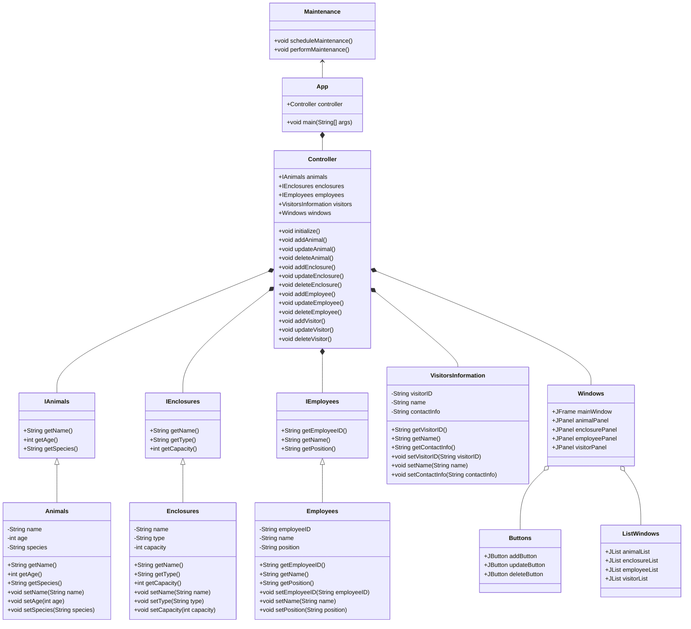
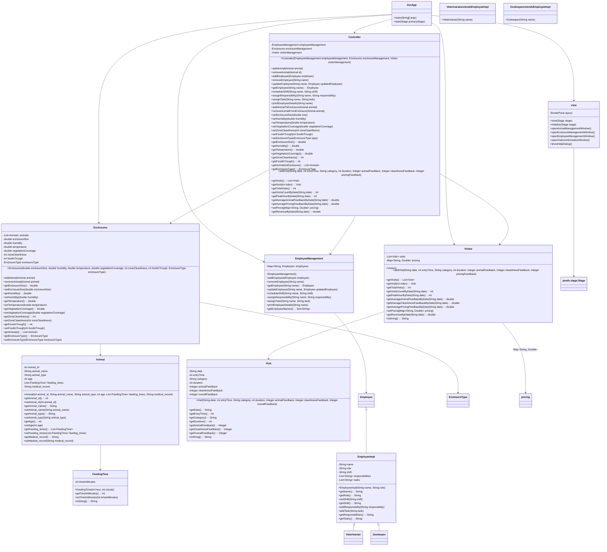

# Final Project for CS 5004 - (APPLICATION NAME/Update)

(remove this and add your sections/elements)
This readme should contain the following information: 

* The group member's names and link to their personal githubs
* Wing Yee Li https://github.com/liwingy
* 
* The application name and a brief description of the application
* Zoo Management System
* 
* Links to design documents and manuals
https://docs.google.com/document/d/1O_sO9AKvfFi_5G2hLLhuA3nowhppxMk9Kv_AlIFhAiw/edit?usp=sharing

Pre UML

Post UML

* Instructions on how to run the application

Ask yourself, if you started here in the readme, would you have what you need to work on this project and/or use the application?