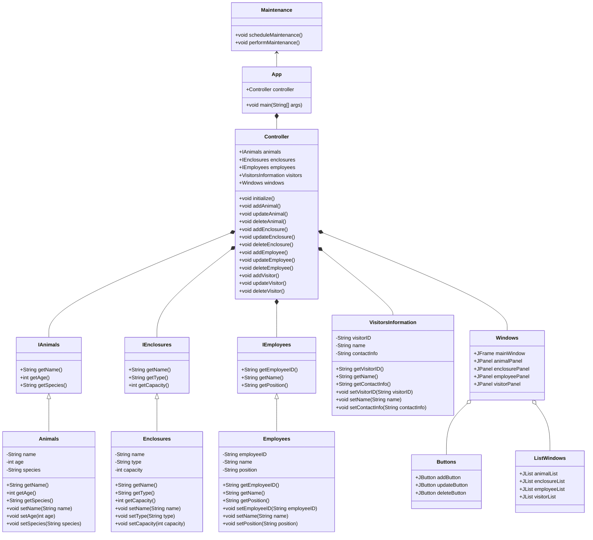
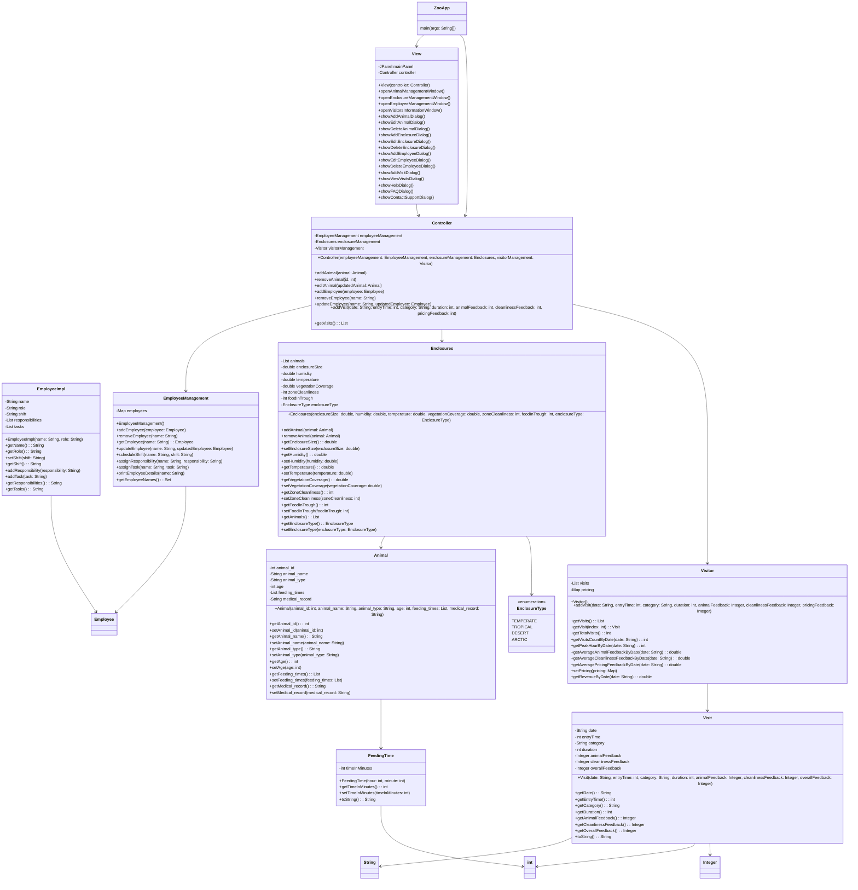

# Final Project for CS 5004 - (APPLICATION NAME/Update)

(remove this and add your sections/elements)
This readme should contain the following information: 

* The group member's names and link to their personal githubs
  Wing Yee Li https://github.com/liwingy
  
* The application name and a brief description of the application
  The application name is G12 Zoo Management System. This is a comprehensive application designed to facilitate efficient zoo management using a Model-View-Controller (MVC) architecture with Java Swing for a rich and interactive user interface. Key features include Animal Management for adding, editing, and deleting animal records, managing species, feeding times, and health records; Enclosure Management for monitoring and maintaining enclosure conditions; Employee Management for handling employee roles, schedules, and records; Visitor Information for tracking visitor details and feedback; and Help and Support sections for FAQs and assistance. This system is designed to streamline zoo operations, improve data accuracy, and enhance overall management efficiency, making it a valuable tool for zoo administrators, keepers, and support staff.
  
* Links to design documents and manuals
https://docs.google.com/document/d/1O_sO9AKvfFi_5G2hLLhuA3nowhppxMk9Kv_AlIFhAiw/edit?usp=sharing

Pre design UML

Post design UML

* Instructions on how to run the application

Ask yourself, if you started here in the readme, would you have what you need to work on this project and/or use the application?