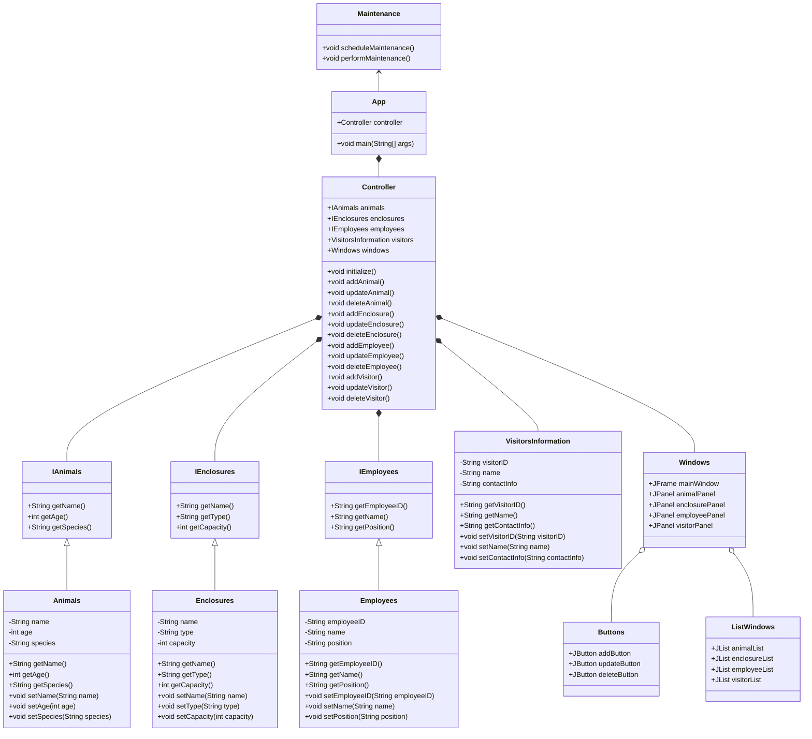
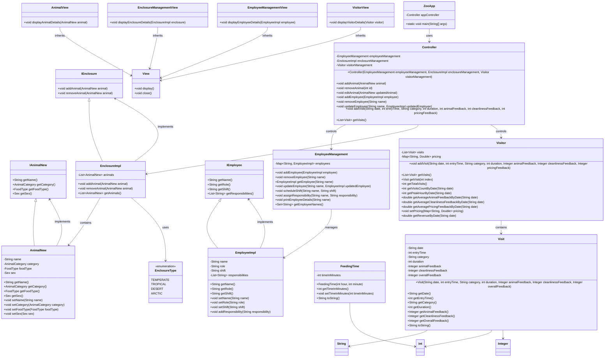

# Final Project for CS 5004 - (APPLICATION NAME/Update)

(remove this and add your sections/elements)
This readme should contain the following information: 

* The group member's names and link to their personal githubs
  Wing Yee Li https://github.com/liwingy
  
* The application name and a brief description of the application
  The application name is G12 Zoo Management System. This is a comprehensive application designed to facilitate efficient zoo management using a Model-View-Controller (MVC) architecture with Java Swing for a rich and interactive user interface. Key features include Animal Management for adding, editing, and deleting animal records, managing species, feeding times, and health records; Enclosure Management for monitoring and maintaining enclosure conditions; Employee Management for handling employee roles, schedules, and records; Visitor Information for tracking visitor details and feedback; and Help and Support sections for FAQs and assistance. This system is designed to streamline zoo operations, improve data accuracy, and enhance overall management efficiency, making it a valuable tool for zoo administrators, keepers, and support staff.
  
* Links to design documents
https://docs.google.com/document/d/1O_sO9AKvfFi_5G2hLLhuA3nowhppxMk9Kv_AlIFhAiw/edit?usp=sharing

* Instructions on how to run the application
* 
Please use the goole doc link below to see user manual

* https://docs.google.com/document/d/1gYCBzU1Terovg1x306U4hsmRh4pdsWT0ZeHF3ABdbUE/edit?usp=sharing

Pre design UML

Post design UML

Ask yourself, if you started here in the readme, would you have what you need to work on this project and/or use the application?

If we started with the README that includes the UML diagram we provided, we'd likely have some questions about whether it gives us everything we need to work on this project or use the application effectively. The UML diagram is helpful for getting an overview of the structure—showing how classes like `Controller`, `AnimalView`, and `EmployeeManagement` are connected. However, while it provides a good starting point, it doesn’t explain the reasoning behind the setup or how these components are meant to interact in practice.

For someone looking to contribute to the project, the diagram lists the classes, methods, and attributes, which is useful, but it lacks context. We’d need more information on what each method is supposed to do and how all these parts work together during runtime. The diagram offers a roadmap, but it doesn’t really tell us how to navigate it. Additionally, to get started with coding, we’d need clear setup instructions—how to set up the environment, what dependencies are required, and how to run the application. The diagram doesn’t cover this, so we’d definitely need more guidance in the README. If we wanted to contribute, we’d also need to know the project’s coding standards and practices. The UML shows us the structure, but we’d need guidelines on how to add or change things without breaking the project.

From a user’s perspective, the UML diagram doesn’t provide much insight into how the app can be used. We’d need a straightforward explanation of the app’s features—what it can do, like managing zoo animals, tracking visitors, or scheduling employees. Even if we know what the app is capable of, we’d still need instructions on how to actually use it. Step-by-step instructions, screenshots, or a user manual would be essential for understanding how to interact with the app’s interface. Moreover, we’d need clear instructions on how to install the app, set up any necessary software, and get it running. Without this, knowing the structure alone isn’t enough to make the app functional.

Overall, while the UML diagram is a good starting point, it doesn’t provide everything we’d need to effectively work on or use the application. We’d need more detailed documentation in the README, including the purpose of the app, examples of how to use it, and troubleshooting tips in case we run into problems. The diagram gives us an outline, but we’d need more comprehensive guidance and context to fully dive in and be productive with this project.
